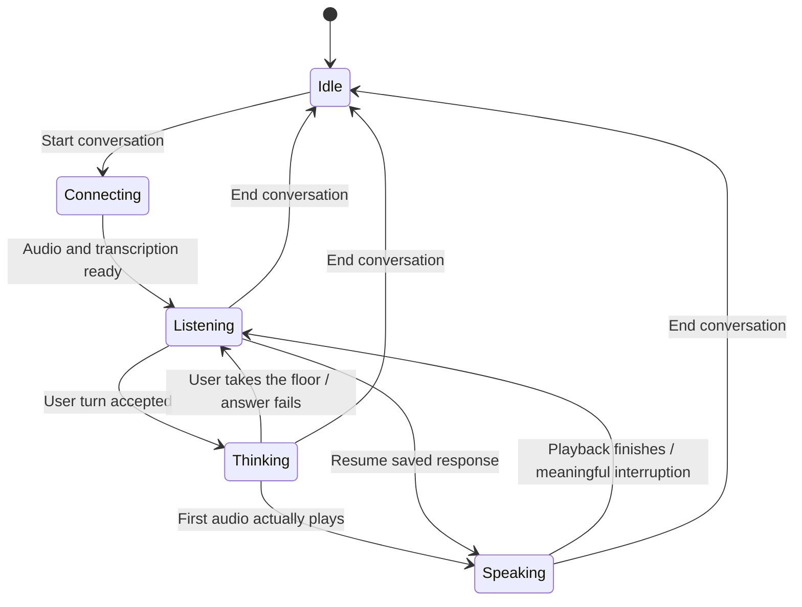
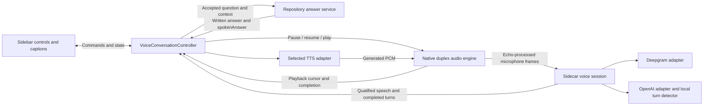

# Continuous voice conversation architecture

Status: proposed implementation contract, October 3, 2026. This document designs
the three requested changes; it does not enable them in the running application.

For the `Cerebras-Sentia` branch, use the
[LiveKit + Cerebras architecture](CEREBRAS_LIVEKIT_ARCHITECTURE.md) alongside this
contract. It replaces the extension-owned conversation coordinator with a
sidecar-hosted LiveKit session and introduces Cerebras narration after
Claude/Codex's repository analysis. The audio safety, cancellation, and playback
requirements below still apply unless explicitly superseded there.

## Intended experience

The user starts a conversation once. The microphone stays active while Sentia
listens, prepares an answer, and speaks. Sentia automatically returns to listening
when playback finishes. A cough or an unfinished sound does not stop the answer.
An intentional phrase pauses playback and gives the user the floor.

Listening, thinking, and speaking describe whose turn it is. They do not switch
the microphone on and off. Input processing continues in all three states.
Connecting, recovering, muted, and idle are additional lifecycle conditions.

## What exists today

| Current implementation                                                                                                                 | Change required                                                                                           |
| -------------------------------------------------------------------------------------------------------------------------------------- | --------------------------------------------------------------------------------------------------------- |
| `App.startVoice()` starts one recording. Its transcript effect sends `voice.stop`, and `submitVoiceTurn()` clears the session.         | Separate conversation lifetime from individual user turns.                                                |
| `SidecarRuntime.startVoice()` opens a provider-specific local WebSocket.                                                               | Keep the connection alive across turns and distinguish connection failure from turn completion.           |
| `transcribe_voice()` forwards provider results and closes the stream after Stop.                                                       | Add a persistent session route with explicit finish-turn, discard-turn, and end-session commands.         |
| `OpenAIRealtimeTranscriptionConnection` combines RMS activity, local SmolLM2 scoring after 600 ms, and a 1.5-second silence fallback. Turn context resets without closing the socket; finals are matched by item ID. | Replace RMS with learned VAD; add the persistent coordinator, echo handling, and multi-item utterance merging. |
| `NativeSpeaker` offers start, write, finish, and stop.                                                                                 | Add playback pause, resume, progress, and actual device completion events.                                |
| Microphone and speaker run in separate native helpers.                                                                                 | Use one native audio engine for simultaneous input/output and echo processing.                            |
| Repository questions carry only workspace, question, and provider.                                                                     | Add bounded conversation context so follow-ups can refer to earlier answers.                              |
| The repository answer returns both `answer` and `spokenAnswer`.                                                                        | Continue using that result; apply `prepareSpeechText()` before synthesis.                                 |

These observations come from the current implementation in
[`App.tsx`](../apps/webview/src/App.tsx),
[`sidecarRuntime.ts`](../apps/extension/src/sidecarRuntime.ts),
[`sentiaViewProvider.ts`](../apps/extension/src/sentiaViewProvider.ts),
[`app.py`](../apps/sidecar/src/sentia_sidecar/app.py),
[`voice.py`](../apps/sidecar/src/sentia_sidecar/voice.py), and the native helpers.
Older documentation describing a browser microphone, browser speech synthesis,
or a mandatory second speech-rendering pass does not describe this active path.

## Ownership and component layout

One extension-owned `VoiceConversationController` coordinates the conversation.
It processes events through a serialized queue. The webview displays its snapshot
and sends commands; it does not independently submit transcripts or run timers.
The queue reduces state synchronously and launches asynchronous effects; it never
waits for a model response inside the queue. Effects post completion events back
with their original IDs. Otherwise a long answer request would block interruption.

The sidecar owns transcription, speech qualification, turn completion, and
conversation context. The native helper owns audio capture and playback. The
existing sidecar workflow machine continues to own repository and coding work;
voice state is separate from that machine and cannot grant coding approval.

Proposed responsibilities:

| Component                                      | Main operations                                                                                                                          |
| ---------------------------------------------- | ---------------------------------------------------------------------------------------------------------------------------------------- |
| `VoiceConversationController` in the extension | `startConversation()`, `handleTurnEvent()`, `handleInterruption()`, `submitAcceptedTurn()`, `handlePlaybackEvent()`, `endConversation()` |
| `NativeDuplexAudio` plus `sentia-audio.m`      | `startCapture()`, `enqueueAudio()`, `pausePlayback()`, `resumePlayback()`, `discardPlayback()`, `muteCapture()`                          |
| `VoiceSession` in the sidecar                  | `feedAudio()`, `finishTurn()`, `discardTurn()`, `updateContext()`, `close()`                                                             |
| `TurnCoordinator` in the sidecar               | Normalize provider signals, assemble user utterances, qualify final text, emit one accepted event per utterance.                         |
| `OpenAITurnDetector`                           | `onSpeechFrame()`, `onTranscriptUpdate()`, `evaluateCompletion()`, `requestCommit()`                                                     |
| `InterruptionGate`                             | `observeSpeech()`, `observeTranscript()`, `evaluateIntent()`, `resetCandidate()`                                                         |
| `ConversationContext`                          | Resolve follow-ups, bound history, track interrupted versus heard answers.                                                               |

## 1. Unified turn detection

### Shared event contract

Provider events are evidence for a turn decision. Only the shared coordinator
emits a turn that the conversation controller may submit.

| Normalized event         | Meaning                                                             |
| ------------------------ | ------------------------------------------------------------------- |
| `speech.started`         | Acoustic speech is present; it may still be noise or a fragment.    |
| `transcript.updated`     | Current words changed; never submit this event.                     |
| `turn.end_candidate`     | The user may be finished; start a cancellable confirmation window.  |
| `turn.resumed`           | Speech resumed before acceptance; cancel the ending candidate.      |
| `turn.accepted`          | Final, non-empty, qualified user utterance, submitted at most once. |
| `turn.discarded`         | Noise, empty turn, cancelled turn, or invalidated candidate.        |
| `interruption.confirmed` | Meaningful speech while Sentia holds the floor.                     |

Each event carries `conversationId`, `connectionEpoch`, `turnId`, `revision`,
`sequence`, and source information. Audio carries monotonically increasing sample
offsets within its capture epoch. Transcript events also carry provider item IDs
where available. Capture timestamps describe sound timing; receipt timestamps
describe network latency. Do not treat transcript arrival time as speech time.

Completion probability is nullable and identifies its source. An application
completion score is not an OpenAI transcription confidence score. Partial text
can change; decisions use the current revision and a short stability window.

### Deepgram adapter

Keep Flux's built-in detection. Map its events as follows:

| Flux event       | Sentia action                                                          |
| ---------------- | ---------------------------------------------------------------------- |
| `StartOfTurn`    | Open a speech candidate and feed the interruption gate.                |
| `Update`         | Update the transcript.                                                 |
| `EagerEndOfTurn` | Emit a provisional ending candidate; do not call the repository agent. |
| `TurnResumed`    | Cancel that candidate and continue the utterance.                      |
| `EndOfTurn`      | Supply final text to the shared coordinator for acceptance.            |

Use `ForceEndTurn` for an explicit finish-turn command. Reserve `CloseStream` for
ending the connection. Flux documents these controls and provisional events in
its [agent guide](https://developers.deepgram.com/docs/flux/agent).

### OpenAI adapter

Implemented groundwork: `sentia_sidecar/eot_model.py` contains the packaged
SmolLM2 scorer; `turn_detection.py` owns a shared background model worker and
per-connection `OpenAITurnDetector` context. The transport checks 150 ms of text
stability after a 600 ms acoustic pause, limits inference to 350 ms and the
remaining 1.5-second silence deadline, and rejects results whose turn generation
or revision changed. `StartOfTurn`, `EagerEndOfTurn`, and `TurnResumed` describe
local candidates; only a provider final produces `EndOfTurn`. Committed item IDs
retain their completion score, duplicate finals are ignored, and speech arriving
while the previous final is pending remains tracked for the next turn.
`add_assistant_context()` supplies answer history for a future persistent
coordinator; `finish_turn()` commits explicitly without ending the connection.
Stop remains an explicit stream-ending action, not a normal turn reset.
The model is general instruction-tuned SmolLM2, so its 0.03 threshold remains a
starting value requiring evaluation; learned VAD and the full persistent state
machine below are not yet implemented.

Retain `gpt-live-transcribe`. It requires application-controlled audio commits;
it cannot enable `server_vad` or `semantic_vad`. Use a transcription-only session
with `turn_detection: null`, following
[OpenAI's realtime transcription guide](https://developers.openai.com/api/docs/guides/realtime-transcription).

Implement three cooperating layers:

1. **Speech activity:** a local learned VAD distinguishes speech from ordinary
   sound. Proposed baseline: pinned Silero ONNX weights in the Python sidecar.
   Use a resampled 16 kHz branch and 512-sample frames; never pass OpenAI's 24 kHz
   stream directly to that model. See the
   [Silero implementation](https://github.com/snakers4/silero-vad/blob/master/src/silero_vad/utils_vad.py).
2. **Completion scoring:** during an acoustic pause, a local end-of-turn model
   evaluates the current transcript and compact conversation context. Put this
   behind `CompletionScorer.predict()`. Evaluate LiveKit's local text detector as
   the initial model candidate; isolate its runtime behind this interface rather
   than adopting an entire agent framework. Its
   [turn detector documentation](https://docs.livekit.io/agents/logic/turns/turn-detector/)
   distinguishes activity detection from completion prediction. Packaging,
   standalone integration, license, and Apple Silicon performance are Phase 0
   checks, not assumed capabilities of our current dependency set.
3. **Endpoint policy:** combine sustained silence, completion score, transcript
   stability, and explicit user commands to decide when to send
   `input_audio_buffer.commit`. A timeout provides a conservative fallback if the
   scorer is unavailable. Resume speech cancels an uncommitted ending candidate.

This gives OpenAI Flux-like start, candidate, resume, and accepted signals.
It does not promise identical detection accuracy across providers.

Example: “Can you explain…” followed by a pause should keep listening longer.
“How does the voice flow work?” followed by silence can finish sooner. The model
must also be evaluated on code names, accents, and unusually short questions.

### Starting policy values

These are proposed tuning values, not measured guarantees or provider defaults.

| Policy                                                             | Initial value                                             |
| ------------------------------------------------------------------ | --------------------------------------------------------- |
| Retained audio before detected speech                              | 300 ms                                                    |
| Acoustic pause before completion evaluation                        | 600 ms                                                    |
| Transcript stability before using it for a decision                | 150 ms                                                    |
| Grace after final text before acceptance                           | 350 ms, cancelled by resumed speech                       |
| Silence fallback for an uncertain or unavailable completion scorer | 5 seconds                                                 |
| Maximum utterance length                                           | 120 seconds; split at a safe boundary with visible status |

Calibrate model thresholds on recordings rather than copying a confidence number
from a different model. The five-second fallback is measured from actual detected
speech. Missing audio packets are a connection problem, not evidence of silence.

An OpenAI audio commit finalizes a provider item, not necessarily the entire user
utterance. If speech resumes while final text or the grace timer is pending,
collect the next item and merge it into the same utterance before submission.
Map completion events by `item_id`; they can arrive out of order. Do not keep the
current single `commit_in_flight` flag that blocks activity tracking for new audio.

Both providers use the same final qualification, grace, explicit finish behavior,
and exactly-once acceptance. Continuous mode replaces the current webview's
two-second submit timer. Existing single-recording mode may retain it.

## 2. Persistent microphone and conversation states

Start one capture process and one local voice session per conversation. Keep
transcription connected through listening, thinking, and speaking. Do not stop
the microphone or close the provider stream when a user turn is accepted.

Capture 24 kHz mono PCM through the new native helper. OpenAI receives this
stream; the sidecar resamples it to 16 kHz for Deepgram and VAD. Reframe native
byte chunks using sample counts because process pipe chunks are not fixed audio
frames. Native capture must keep its real-time callback free of blocking pipe
writes; use a bounded queue and a dedicated writer.

| Event                                     | Transition and action                                                                       |
| ----------------------------------------- | ------------------------------------------------------------------------------------------- |
| Conversation ready                        | Enter listening.                                                                            |
| Accepted user turn                        | Enter thinking; start one repository request with bounded history.                          |
| Answer ready                              | Display it, prepare pronunciation, begin TTS; remain thinking until actual playback starts. |
| Device playback started                   | Enter speaking.                                                                             |
| Device playback completed                 | Enter listening; leave capture and transcription running.                                   |
| Qualified new speech while thinking       | Hold the old response and enter listening; collect the new utterance.                       |
| Qualified interruption while speaking     | Pause playback, retain its cursor, enter listening.                                         |
| Explicit “continue” with a saved response | Resume at the saved cursor; enter speaking on playback acknowledgment.                      |
| New question after interruption           | Discard the saved remainder; enter thinking for the new turn.                               |
| Cough or rejected speech candidate        | Stay in the current state; keep playing or thinking.                                        |
| TTS failure                               | Keep the written answer; return to listening.                                               |
| Input/sidecar connection loss             | Enter recovering; suppress submission until a fresh connection is ready.                    |
| End conversation                          | Stop capture and playback, cancel timers and requests, close transports, enter idle.        |

Maintain separate input substates (`quiet`, `speech_candidate`, `collecting`,
`end_candidate`) and playback substates (`buffering`, `playing`, `paused`,
`drained`). These avoid multiplying every conversation state into a separate
public UI mode. Muting is orthogonal: suspend capture/delivery and show “Mic
muted”; an existing answer may finish playing. Unmute begins a fresh input turn.

**Playback completion must mean the user finished hearing the audio.** The
existing TTS completion promises resolve after audio is generated/queued, and
`NativeSpeaker.finish()` only closes stdin. Replace this assumption with explicit
native playback events and a rendered sample cursor.

### Conversation context

Persistent audio alone does not create conversational memory. Add a
`conversationId` and accepted `turnId` to repository requests. Keep bounded,
workspace-scoped context in the sidecar: recent user turns, concise answer text,
referenced files/symbols, evidence revisions, and playback status.

Pass this context into both file selection and answer generation for Claude and
Codex. A follow-up such as “Where is that called?” can then resolve “that” before
retrieval. Re-read current evidence when files have changed. Prior answers provide
conversation context, not proof of current code behavior. Preserve ephemeral SDK
threads and the existing repository evidence validation.

Record whether an answer was displayed, fully heard, or interrupted. Exact
word alignment is not currently supplied; use sample progress and coarse sentence
boundaries where available, without pretending the whole spoken answer was heard.

### Stale work and cancellation

Assign every answer attempt a `responseId` and increasing response generation.
Capture this identity at request start, TTS start, and every playback write.
Ignore callbacks for a retired generation, even if network cancellation failed.
Never let an old answer start speaking after a newer user turn takes priority.

During a speech candidate while thinking, hold a completed old answer. Release it
if the candidate is rejected. Once the new utterance is accepted, cancel the old
request and start the replacement. Only one authoritative repository answer
request is active per conversation. Add sidecar request cancellation keyed by
`responseId`; aborting an HTTP fetch alone does not guarantee provider work stops.
Codex's current service lock also needs cancellation to release promptly.

Stopping speech does not cancel an approved coding run. End conversation cancels
voice-owned answer work only; coding cancellation remains its separate control.

## 3. Intelligent interruption

### Remove playback echo before classifying input

Sentia's own loudspeaker output will reach its microphone. Loudness thresholds
and transcript comparison alone cannot solve that problem.

Replace the separate input/output processes with a native duplex helper using
one `AVAudioEngine`, voice processing, and an `AVAudioPlayerNode`. The helper has
both the playback reference and microphone input. Validate echo suppression on
actual macOS audio routes; enabling a flag is not proof of reliable cancellation.
Apple documents
[voice processing](<https://developer.apple.com/documentation/avfaudio/avaudioionode/setvoiceprocessingenabled(_:)>)
and [player pause](<https://developer.apple.com/documentation/avfaudio/avaudioplayernode/pause()>).
Deepgram also describes echo and noise handling in its
[audio preprocessing guide](https://developers.deepgram.com/guides/deep-dives/audio-preprocessing-barge-in).

Use framed binary messages over stdin/stdout for PCM and control, with dedicated
read/write loops. Tag playback writes by `responseId`; send structured playback
events separately from human-readable stderr logs. Pausing the player node must
leave the capture engine running. Pausing the whole engine would disable the
microphone at exactly the wrong moment.

### Qualify speech before pausing

The interruption gate uses echo-processed audio plus the evolving raw transcript.
Repository spelling correction runs afterward so it cannot turn an ambiguous
sound into an apparent interruption command.

1. Open an internal candidate after sustained acoustic speech. Continue playback
   while it remains unqualified, and retain the opening audio.
2. Confirm when there is both acoustic evidence and a stable, meaningful phrase.
   Initial policy: at least 300 ms of voiced audio plus at least two complete
   words. Do not treat arbitrary transcript token fragments as complete words.
3. Allow short explicit controls such as “stop,” “wait,” and “pause” to qualify
   with one stable complete word and shorter acoustic evidence (initially 150 ms).
   Permit a single repository identifier when it is a clear contextually relevant
   correction; it must pass a stricter stability/intent check.
4. Reject coughing, clicks, isolated half-words, and brief backchannels such as
   “mm-hmm” or “okay” during playback. A longer phrase such as “okay, but why?”
   remains eligible. A learned intent classifier can improve ambiguous cases;
   it is not a mandatory repository-agent call for every sound.
5. On confirmation, pause locally and preserve the playback cursor. Keep listening
   until the user finishes; dispatch resume/stop controls or a new repository turn.

No transcript means no semantic confirmation. Do not cancel playback merely
because a long loud sound exceeds a timeout. Network-delayed transcripts may make
interruption slower; keep a manual Pause control available. Background human
speech can still look meaningful: V1 assumes one primary user, and must test
nearby voices. Speaker identification would be a separate improvement.

| What the mic hears during playback   | Expected result                                                           |
| ------------------------------------ | ------------------------------------------------------------------------- |
| Cough, fan, keyboard click           | Continue speaking.                                                        |
| “ex…” and then silence               | Continue speaking.                                                        |
| “mm-hmm”                             | Continue speaking.                                                        |
| “Wait, explain that function”        | Pause, collect the utterance, answer it.                                  |
| “Stop”                               | Pause promptly, then discard the remainder when the command is confirmed. |
| “Continue” after a pause             | Resume the saved response.                                                |
| Sentia's own speech through speakers | Echo processing removes it; no new user turn.                             |

Pause must be reversible. Retain queued audio, a rendered cursor, and the response
identity while an interruption finishes. If later transcript revisions invalidate
the interruption, resume the same response. Do not automatically resume while
the user is still speaking. A new accepted question permanently retires the old
remainder; its full written answer remains available.

### Bound paused audio and generation

Pause the device immediately on qualification, then apply backpressure to audio
delivery. Synthesize bounded sentence groups with explicit segment IDs and frame
ranges in both adapters. Send each Deepgram group as a separate serialized TTS
turn on the reusable socket; a single whole-answer `Speak` has no reliable local
sentence-to-audio mapping. Measure the additional flush overhead during Phase 0.

Bound queued PCM (initial proposal: 10 seconds, including a reserved active
segment). Stop starting subsequent sentence groups while paused. Keep the audio
for the partially heard segment so resuming can continue at its exact sample.
If a provider request must be aborted at the buffer limit, regenerate only fully
unplayed segments. Do not regenerate a partially heard segment and pretend its
old sample offsets map to the new audio. If that segment cannot be retained,
surface a paused-answer recovery rather than silently restarting it.

Deepgram may continue sending an already-requested group. On overflow retire that
TTS connection and reject its late audio; preserve the listen connection. Its
current `cancelPlayback()` discards output and is not a pause. Do not rely on
undocumented provider pause controls. Device acknowledgment tracks the cursor at
the actual pause, including audio rendered after the pause request was sent.

## Protocol and function changes

Add explicit continuous-mode commands; keep the old one-recording contract until
migration is complete:

- `voice.conversation.start`: choose provider, bind workspace and conversation.
- `voice.turn.finish`: finalize input without closing capture/transcription.
- `voice.turn.discard`: abandon current input without ending the conversation.
- `voice.playback.pause`, `voice.playback.resume`, `voice.playback.stop`.
- `voice.input.mute`, `voice.input.unmute`.
- `voice.conversation.end`: end the entire session.

Emit `voice.conversation.state`, normalized turn events, and
`voice.playback.started/progress/paused/resumed/completed/error`. Include IDs,
epochs, and sequences in snapshots so a reloaded sidebar can render current state
without replaying a submitted turn. Mirror validators in Python and TypeScript
and use shared JSON fixtures, following the existing protocol convention.

| Existing function/file                                                            | Planned modification                                                                                                              |
| --------------------------------------------------------------------------------- | --------------------------------------------------------------------------------------------------------------------------------- |
| `App.startVoice()`, `submitVoiceTurn()`, transcript effects, `voiceSubmission.ts` | Move submission ownership and timers into the controller; render persistent state and controls.                                   |
| `SentiaViewProvider.handleMessage()`                                              | Delegate continuous-mode commands to the controller; keep typed input and explicit flow-map routing.                              |
| `SentiaViewProvider.postVoiceMessage()`                                           | Stop capture only for session termination/fatal failure, not for an individual accepted turn.                                     |
| `SidecarRuntime.startVoice()/stopVoice()/cancelVoice()`                           | Add persistent session lifecycle and distinct finish/discard/end operations.                                                      |
| `transcribe_voice()`                                                              | Introduce a versioned persistent route; audio and result tasks survive ordinary turn endings.                                     |
| `DeepgramFluxConnection.close_stream()`                                           | Keep as connection shutdown; add `finish_turn()` using `ForceEndTurn`.                                                            |
| `OpenAIRealtimeTranscriptionConnection`                                           | Use transcription-only configuration; per-item commits/finals, no per-turn socket close, no RMS-only endpoint policy.             |
| `NativeMicrophone`, `NativeSpeaker`, native build script                          | Introduce the duplex helper and bounded audio/control channels.                                                                   |
| `DeepgramSpeech` and `OpenAISpeech`                                               | Supply audio through an injected shared playback sink; separate synthesis done from playback done and respect pause/backpressure. |
| `askRepository()`, `RepositoryQuestion`, intelligence router, both agent services | Add bounded context, response identity, and targeted cancellation.                                                                |
| `prepareSpeechText()`                                                             | Preserve the Sentia → “Sen-shia” pronunciation step before synthesis.                                                             |

An accepted explicit flow-map request should return to listening after the panel
opens. It has no ordinary spoken answer unless one is deliberately provided.

## Recovery, resource limits, and controls

- Freeze provider selection within a live session. Switching ends it cleanly and
  starts a new connection epoch; history can remain within the same workspace.
- On provider loss, enter recovering and retain at most two seconds of input
  locally. Reconnect with a new epoch and request repetition if speech was lost;
  never silently replay an already-accepted turn.
- On sidecar/native failure or loss of workspace trust, release audio devices and
  require a fresh session. Explicit ending and mute always take effect locally.
- Keep a visible mic indicator through thinking/speaking, with End conversation,
  Mute, Finish turn, and Pause/Resume answer controls. Continuous transcription
  can consume provider usage throughout the session; keep an idle timeout and
  account for live listening minutes during testing.
- Keep credentials in SecretStorage/trusted process memory. Use bounded in-memory
  audio buffers; no recordings or raw transcript payload logs by default.
- Reset capture, resampling, VAD, and echo state after an audio-device change.

## Implementation order and acceptance

| Phase                       | Deliverable                                                                                                                                    | Completion check                                                                                                           |
| --------------------------- | ---------------------------------------------------------------------------------------------------------------------------------------------- | -------------------------------------------------------------------------------------------------------------------------- |
| 0: feasibility and fixtures | Pin/evaluate VAD and completion model; prototype native duplex echo processing and player pause; collect representative evaluation recordings. | Runs on supported Intel/Apple Silicon macOS; dependencies and model packaging are reviewed; echo test shows no self-turns. |
| 1: contracts and controller | Shared events, IDs, state reducer, explicit session/turn controls, deterministic event tests.                                                  | Reordered/duplicate events cannot submit twice; UI cannot race its own timers.                                             |
| 2: continuous sessions      | Persistent transcription, multi-item OpenAI handling, Deepgram finish-turn control, bounded history and cancellation.                          | Ten consecutive turns without a mic restart; follow-ups resolve prior references; stale answers cannot speak.              |
| 3: interruption             | Duplex playback sink, qualified speech gate, pause/resume, bounded buffering.                                                                  | Both providers pass noise/echo/fragment tests and intentional interruption tests.                                          |
| 4: tune and ship            | Measured thresholds, failure recovery, long-session/device testing, user-facing controls.                                                      | Release targets below are met; unsupported routes surface a clear fallback.                                                |

The completion model and echo prototype are the first tasks. A silence-only
OpenAI fallback can ship as an intermediate milestone, but cannot claim the
complete turn-understanding experience.

Proposed release targets, measured on the agreed evaluation set:

- Zero duplicate accepted turns or stale-generation playback writes.
- No microphone restart during a healthy 30-minute conversation.
- No accepted self-echo turns in a 30-minute speaker playback test.
- At most one false interruption per 30 minutes of representative noise;
  isolated cough and fragment fixtures cause no interruption.
- At least 95% of intentional interruption phrases are detected on the fixture
  set; acknowledge acoustic/transcript uncertainty rather than claiming perfection.
- Device pause acknowledgment within 150 ms of **qualified interruption**, with
  speech-onset-to-pause latency measured separately (initial target 800 ms p95).
- Correct handling of thinking-time speech, delayed/out-of-order final transcripts,
  continued speech after commit, buffer overflow, TTS/provider failure, mute,
  editor reload, device changes, and explicit End conversation.

Measure end-of-turn delay, premature endings, interruption false positives/misses,
qualified-to-pause latency, queue depth, and actual playback completion separately
for each provider. These measurements determine tuning; the architecture alone
cannot guarantee that every cough or half-word will be classified correctly.
